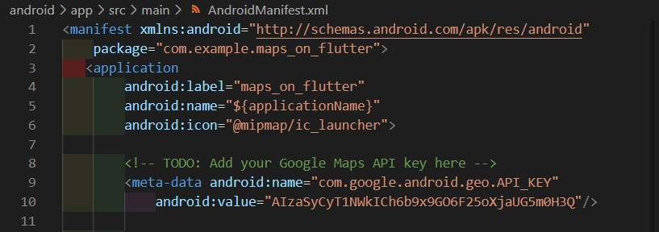
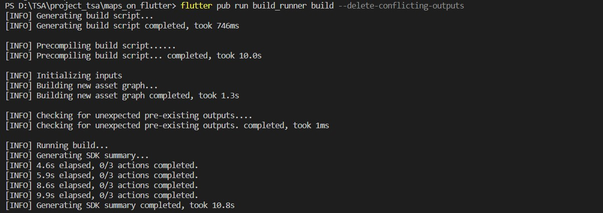

# maps_on_flutter

### Menambahkan plugin Google Maps Flutter sebagai dependensi

### Menambahkan Google Maps di Flutter untuk Web

### Mengonfigurasi minSDK Android

### Menambahkan kunci API untuk aplikasi Android

### Membuat tampilan di `main.dart`

### Menjalankan aplikasi

### Menambahkan paket http untuk membuat permintaan HTTP

### Menambahkan json_serializable untuk mendeklarasikan struktur objek agar merepresentasikan dokumen JSON

### Menambahkan build_runner sebagai dependensi waktu pengembangan

### Menguraikan JSON dengan pembuatan kode dengan membuat `location.dart` di dalam `lib/src`

 
IDE (jika Anda menggunakannya) akan menampilkan beberapa garis bergelombang merah, karena IDE ini merujuk ke file seinduk yang tidak ada, `locations.g.dart`.

### Buat file `locations.g.dart` dengan menjalankan `build_runner`

### Menambahkan file fallback `locations.json` ke bagian flutter di file `pubspec.yaml`

### Ubah file `main.dart` untuk meminta data peta, lalu gunakan info yang ditampilkan untuk menambahkan kantor ke peta

### Menjalankan aplikasi

